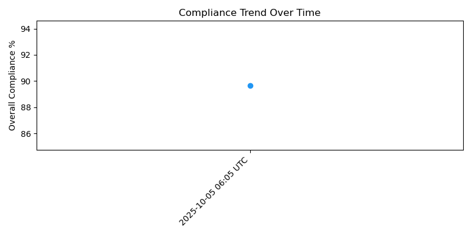

# 🧩 Regulatory Compliance Automation  

A full automation framework for **Active Directory & Server compliance validation** against  
SOX • PCI-DSS • ISO 27001 • NIST CSF controls — built with **PowerShell**, **Python**, and **GitHub Actions**.

---

## ⚙️ Overview
This project demonstrates automated control validation, compliance scoring, and report generation in real-time CI pipelines.  
Each run scans configuration data (simulated or live) and produces a **dashboard with trend analytics** and compliance visuals.

---

## 🧰 Tech Stack
| Layer | Tool | Purpose |
|-------|------|----------|
| Data Collection | PowerShell | Capture system & AD configuration |
| Analytics | Python (pandas + matplotlib) | Score controls, trend analysis |
| Automation | GitHub Actions | CI/CD with daily runs |
| Reporting | HTML Dashboard + CSV logs | Export compliance summaries |

---

## 📊 Metrics Pipeline
- Each workflow run computes control compliance per framework.
- Generates:  
  - `reports/compliance_report.html` – visual dashboard  
  - `reports/compliance_trend.csv` – historical trend  
  - `reports/bar_chart.png` and `reports/trend_chart.png` – visual artifacts  
- Artifacts automatically uploaded for download under **GitHub → Actions → Artifacts**.

---

## 🖼️ Preview
> _Auto-generated dashboard sample_

  
  

---

## 🚀 Automation Workflow
| Event | Trigger |
|--------|----------|
| `push` | Revalidates data & regenerates report |
| `cron` | Scheduled daily compliance scan |
| `workflow_dispatch` | Manual “Run workflow” button |

All runs output downloadable HTML dashboards for stakeholders.

---

## 🔐 Email Integration
Optionally sends the compliance report as an email attachment to designated recipients.

Add repository secrets under:  
**Settings → Secrets → Actions**
SMTP_USER = my_email@example.com

---

## 🧱 Folder Structure
grc-compliance-automation/
├── data/ → Source scan results (CSV)
├── reports/ → HTML dashboards & metrics
├── scripts/ → Python automation scripts
└── .github/workflows/ → CI pipeline definitions

---

## 🏗️ Next Phase
- Integrate real PowerShell-based Active Directory scans  
- Link results to Power BI for real-time dashboards  
- Expand framework coverage for GDPR & NDPR control sets  

---

## 👨‍💻 Author
**Bassey Solomon Henry**  
Cybersecurity & GRC Engineer | Cloud Security | DevSecOps  
🔗 [LinkedIn](https://www.linkedin.com/in/bassey-solomon-henry)  
🌐 [Portfolio](https://lighthouse-technology.vercel.app)

